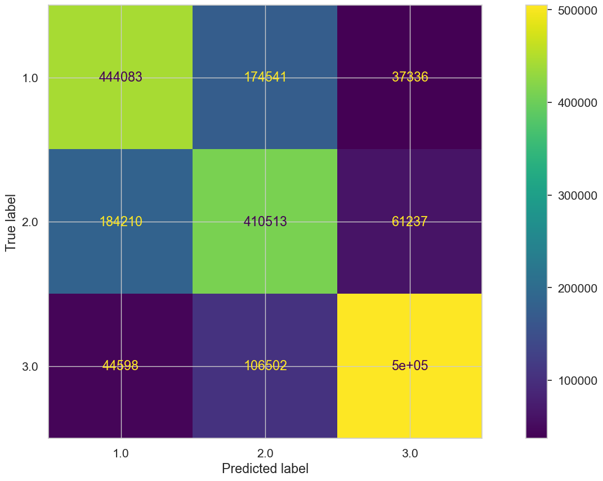
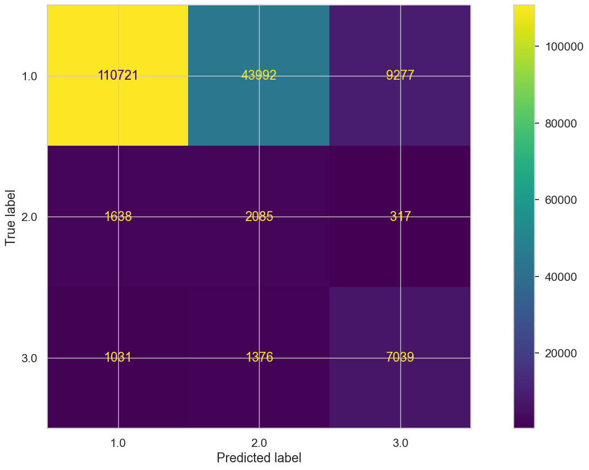

<!-- Improved compatibility of back to top link: See: https://github.com/othneildrew/Best-README-Template/pull/73 -->
<a name="readme-top"></a>
<!--
*** Thanks for checking out the Best-README-Template. If you have a suggestion
*** that would make this better, please fork the repo and create a pull request
*** or simply open an issue with the tag "enhancement".
*** Don't forget to give the project a star!
*** Thanks again! Now go create something AMAZING! :D
-->


<!-- PROJECT SHIELDS -->
<!--
*** I'm using markdown "reference style" links for readability.
*** Reference links are enclosed in brackets [ ] instead of parentheses ( ).
*** See the bottom of this document for the declaration of the reference variables
*** for contributors-url, forks-url, etc. This is an optional, concise syntax you may use.
*** https://www.markdownguide.org/basic-syntax/#reference-style-links
-->
[![Contributors][contributors-shield]][contributors-url]
[![LinkedIn][linkedin-shield]][linkedin-url]


<!-- PROJECT LOGO -->
<br />
<div align="center">
  <a href="https://github.com/AlselloDM/Final-Project">
    
  </a>

<h3 align="center">Credit-Risk-Prediction</h3>

  <p align="center">
    Notebook Final project Hacktiv8 HCK-006 Alsello Diveni Manuputty
    <br />
    <a href="https://github.com/AlselloDM/Final-Project"><strong>Explore the docs »</strong></a>
    <br />
    <br />
    <a href="https://github.com/AlselloDM/Final-Project">View Demo</a>
    ·
    <a href="https://github.com/AlselloDM/Final-Project/issues">Report Bug</a>
    ·
    <a href="https://github.com/AlselloDM/Final-Project/issues">Request Feature</a>
  </p>
</div>

<!-- ABOUT THE PROJECT -->
## Objective

[![Kredit][product-screenshot]](https://www.kaggle.com/datasets/ranadeep/credit-risk-dataset)

Pada notebook ini akan dilakukan pengerjaan Final Project dimana akan dibuat model *Classification* untuk memprediksi `status` resiko hutang menggunakan dataset dari [link](https://www.kaggle.com/datasets/ranadeep/credit-risk-dataset) ini. Dataset juga bisa diakses [disini](https://drive.google.com/drive/folders/1PuZDfzDjrO12mQtCTQzLqQehtjl3KaaN?usp=sharing).Pada kasus ini, analis ditugaskan untuk membuatkan sebuah model untuk memprediksi dari data yang berisi informasi umum dari *`debitur`*. Karena resiko salah klasifikasi sangat fatal, maka perlu dilakukan *modelling* dengan berusaha untuk meningkatkan *`accuracy`* model. Namun, dari hasil screening awal ternyata proporsi datanya tidak setara. Hal ini akan menjadi masalah nantinya saat pembuatan model. Dengan model ini, diharapkan bank bisa meringankan kerja tim analisis resiko dalam proses screening dan bisa mengarahkan energi yang tersisa ke pekerjaan lain yang memang butuh seorang manusia untuk melakukannya.

<p align="right">(<a href="#readme-top">back to top</a>)</p>


<!-- GETTING STARTED -->
## Proses Pengerjaan

Urutan pengerjaannya adalah sebagai berikut

### Prerequisites

Beberapa library yang perlu di-install dahulu.
* pandas
  ```sh
  !pip install pandas
  ```
  * seaborn
  ```sh
  !pip install seaborn
  ```
  * matplotlib
  ```sh
  !pip install matplotlib
  ```
  * numpy
  ```sh
  !pip install numpy
  ```
  * Scikit-learn
  ```sh
  !pip install scikit-learn
  ```
  * feature-engine
  ```sh
  !pip install feature_engine
  ```
### Data Loading
Setelah sudah di-import, langsung saja akan dilakukan loading data. Dataset yang digunakan juga ada [disini](https://drive.google.com/drive/folders/1PuZDfzDjrO12mQtCTQzLqQehtjl3KaaN?usp=sharing).Pada bagian ini juga akan digunakan serangkaian cara untuk mendapatkan overview data.
Pada bagian ini juga digunakan domain knowledge sebagai filter data karena kolom terdiri dari 2 int, 49 float dan 22 object type features.
Sampai akhirnya berikut adalah data-data yang dipilih:
| Column Name      			| Explanation                                                            |
|---------------------------|------------------------------------------------------------------------|
| addr_state				| Area domisili bisa memberi pengaruh kepada pembayaran hutang berdasarkan kondisi ekonomi, lapangan pekerjaan, dsb.       |
| annual_inc       			| Pendapatan debitur adalah faktor penting dalam menilai kemampuan pembayarannya.  |
| application_type 			| Perbedaan tipe aplikasi seperti individual atau joint memiliki kemungkinan berpengaruh terhadap resiko.     |
| delinq_2yrs	   			| Jumlah kategori pembayaran 'delinquent' dalam 2 tahun kebelakang bisa menentukan pola kebiasaan membayar debitur.|
| dti	   					| Rasio Debt-to-Income dapat mengukur kestabilan finansial debitur.													|
| emp_length	   			| Lama bekerja debitur bisa mengukur kestabilan pekerjaan yang berpengaruh kepada kemampuan membayarnya				|
| grade	   					| Penggolongan grade adalah penilaian resiko kredit dari kreditur 
|          					|Grade A: Resiko rendah, diprediksi menguntungkan dan debitur dengan kekuatan finansial yang baik.
|          					|Grade B: Resiko menengah dengan status kredit yang baik.
|          					|Grade C: Resiko menengah hingga tinggi dengan beberapa indikator kredit beresiko.
|          					|Grade D: Resiko tinggi dengan profil kredit yang lebih lemah.
|          					|Grade E: Resiko tinggi dengan riwayat kredit terbatas atau memiliki indikator kredit beresiko dalam jumlah tinggi.
|          					|Grade F: Resiko tinggi dengan riwayat kredit yang buruk seperti jumlah hutang yang tinggi, dan pembayaran yang terlambat
|          					|Grade G: Resiko tertinggi dengan riwayat kredit yang sangat buruk dan masalah kredit lainnya yang lebih berat.
| home_ownership			| Dapat menggambarkan kestabilan situasi finansial debitur.
| inq_last_6mths	   		| Menggambarkan aktivitas kredit debitur belakangan ini.
| int_rate	   				| Dapat berkorelasi dengan tingkat resiko debitur.
| purpose	   				| Dapat memprediksi komitmen membayar debitur.
| revol_util	   			| Menunjukan berapa kredit yang tersedia untuk debitur
| term	   					| Dapat berpengaruh ke kemampuan debitur dalam mengelola pembayaran.
| total_acc	   				| Jumlah total pinjaman dapat memberikan informasi mengenai riwayat kredit debitur.
| acc_now_delinq	   		| Jumlah akun yang saat ini menunggak dapat mengindikasikan masalah kredit yang sedang berlangsung.
| tot_cur_bal	   			| Dapat mencerminkan beban kredit peminjam secara keseluruhan.
| pub_rec					| Jumlah catatan publik seperti bangkrut, repo, pajak dapat mempengaruhi kelayakan kredit.
| mths_since_last_delinq	| Dapat menggambarkan kebiasaan membayar debitur belakangan ini.
| mths_since_last_record	| Dapat menggambarkan resiko kredit
| total_pymnt	 			| Menggambarkan riwayat pembayaran.
| open_acc	   				| Dapat mengindikasikan aktivitas kredit debitur.
| collections_12_mths_ex_med| Dapat menggambarkan masalah kredit belakangan ini.
| loan_amnt	   				| Mungkin berkorelasi dengan resiko itu sendiri.
| recoveries	   			| Mungkin berkorelasi dengan kredit macet(Default)
| verification_status	  	| Dapat mengindikasikan keaslian laporan keuangan debitur.
| loan_status				| Target Prediksi

Pemilihan data berdasarkan dari pengetahuan saya mengenai analisa kredit. Dapat dilihat dari uraian diatas bahwa saya hanya memilih kolom-kolom yang sekiranya memang menggambarkan analisa kreditnya. Beberapa kolom seperti address, grade atau apapun yang sekiranya dapat memberi unsur diskriminasi hanya dipakai untuk keperluan eksplorasi datanya saja. Kalaupun nantinya tidak digunakan dalam model, nanti akan dibuang.

<p align="right">(<a href="#readme-top">back to top</a>)</p>

### Exploratory Data Analysis
Pada bagian ini dilakukan beberapa analisa data. Yang pertama dilakukan adalah mengamati kolom target prediksi yang memiliki jumlah sebagai berikut:
| Loan Status      			| Count                                                            |
|---------------------------|------------------------------------------------------------------------|
Current                                             |   601779|
Fully Paid                                          |   207723|
Charged Off                                         |   45248|
Late (31-120 days)                                  |  11591|
Issued                                              |  8460   |
In Grace Period                                     | 6253    |
Late (16-30 days)                                   |     2357|
Does not meet the credit policy. Status:Fully Paid  |    1988|
Default                                             |   1219|
Does not meet the credit policy. Status:Charged Off |    761|
Dari list diatas terlihat bahwa data memiliki banyak variasi dan tergolong tidak setara(imbalance). Oleh karena itu, nanti akan dicoba untuk dikurangi variasi kelasnya di bagian Feature Engineering. Mungkin kelas ini bisa dibagi menjadi seperti


>1. Issued, Current, Fully Paid, Does not meet the credit policy. Status:Fully Paid (Kategori 1)
>- Current - Semua pembayaran tepat waktu
>- Fully Paid - Semua kewajiban bayar sudah dipenuhi dan hutang sudah selesai
>2. In Grace Period, Late (16-30 days), Late (31-120 days) (Kategori 2)
>- In Grace Period - 1-15 hari terlambat dari jatuh tempo
>- Late (16-30 days) - 16-30 hari terlambat dari jatuh tempo
>- Late (31-120 days) - 31-120 hari terlambat dari jatuh tempo
>3. Charged Off , Does not meet the credit policy. Status:Charged Off, Default (Kategori 3)
>- Default - Tidak bisa melakukan pembayaran dalam jangka waktu yang lama
>- Charged Off - Tim yang bersangkutan sudah memberi label bahwa hutang ini tidak akan bisa dibayar

Sisanya adalah visualisasi-visualisasi tambahan yang bisa diamati lebih mendetil pada notebook. Secara data, kolom yang ada semuanya terlihat berguna untuk prediksi target. Data target prediksi juga tidak setara(imbalance) dan jumlah baris data nya ini termasuk besar. Oleh karena itu, saat pengerjaan notebook ini saya menghabiskan waktu yang lama saat proses pemahaman data, seleksi fitur, dan juga modelling. Banyaknya kolom dan baris ini cukup merepotkan karena keterbatasan hardware. Jujur saja, data ini sangat menarik untuk dilakukan analisa mendalam seperti yang sudah saya lakukan pada bagian Exploratory Data Analysis. Masih banyak sekali yang dapat diamati lalu dibuatkan visualisasinya. Mungkin untuk improvement kedepannya, hal yang pertama akan saya lakukan adalah hal ini. Sebagai summary, akan saya sampaikan kembali bahwa dari data terlihat bahwa dari keseluruhan debitur, perbandingan dari yang beresiko dengan yang tidak beresiko sangat jauh. Hal ini saya sadari perbedaannya dengan kenyataannya di Indonesia. Informasi yang pernah saya dapatkan dari internet menyatakan bahwa untuk di Indonesia, bank atau penyedia layanan kredit seperti ini sangat menguntungkan. Hal ini karena standar gaji yang kecil, namun ego yang tinggi menjadikan kita sebagai salah satau bangsa paling konsumtif di dunia. Secara datanya sendiri, jumlah debitur yang beresiko pasti lebih banyak. **Oleh karena itu, data apapun yang kita gunakan sebagai dasar dari model tidak akan bisa diimplementasikan di Indonesia.** Dari segi manapun jika menggunakan pandangan kredit, Indonesia tergolong anomali. Mulai dari mental yang tidak malu jika berhutang, sampai tidak malu jika tidak bayar hutang itu semuanya ada di Indonesia. Saya setuju soal penagihan hutang yang keras untuk kasus yang memang sudah sangat berat.

### Feature Engineering
Pada bagian ini, kita bisa menambahkan kolom berisi informasi representatif dari beberapa kolom untuk meringankan kerja model dan bisa juga membuang kolom-kolom yang sekiranya tidak berguna untuk model dengan proses bernama Feature Selection. Pembagian kelas target yang baru juga dilakukan pada bagian ini. Karena data tidak terlihat dapat menghasilkan fitur baru, maka selanjutnya langung dilakukan Preprocessing serta Imbalance Handling. Seperti yang sudah saya sebutkan pada bagian EDA, semua data adalah memang data yang terpilih. Oleh karena itu, saya putuskan untuk tidak melakukan feature selection.

### Modelling
Untuk modelling, akan digunakan metode Logistic Regression. Dasar pemilihan metode ini adalah karena perhitungannya yang simpel, sehingga model ini bisa melakukan klasifikasi yang cukup baik tanpa waktu yang lama. Berhubung waktu sudah banyak habis di bagian preprocessing, saya sudah yakin sekali bahwa untuk modelling akan menghabiskan waktu lebih banyak lagi jika digunakan model-model yang lain yang lebih berat.

<br />
<div align="center">
  <a href="https://github.com/AlselloDM/Final-Project">
    
  </a>

<br />
<div align="center">
  <a href="https://github.com/AlselloDM/Final-Project">
    
  </a>

**Classification Report Logistic Regression Train Set**

|          | Precision | Recall | F1-Score | Support |
|----------|-----------|--------|----------|---------|
| 1.0      | 0.66      | 0.68   | 0.67     | 655960  |
| 2.0      | 0.59      | 0.63   | 0.61     | 655960  |
| 3.0      | 0.84      | 0.77   | 0.80     | 655960  |
| Accuracy |           |        | 0.69     | 1967880 |
| Macro Avg| 0.70      | 0.69   | 0.69     | 1967880 |
| Weighted Avg| 0.70   | 0.69   | 0.69     | 1967880 |

**Classification Report Logistic Regression Test Set**

|          | Precision | Recall | F1-Score | Support |
|----------|-----------|--------|----------|---------|
| 1.0      | 0.98      | 0.68   | 0.80     | 163990  |
| 2.0      | 0.04      | 0.52   | 0.08     | 4040    |
| 3.0      | 0.42      | 0.75   | 0.54     | 9446    |
| Accuracy |           |        | 0.68     | 177476  |
| Macro Avg| 0.48      | 0.65   | 0.47     | 177476  |
| Weighted Avg| 0.93   | 0.68   | 0.77     | 177476  |
</div>


### Model Evaluation Conclusion

Untuk melakukan evaluasi model ini, saya menggunakan hasil dari prediksi test dan trainnya, di mana saya fokus pada nilai **recall**  model, yang merupakan penilaian mengenai semua prediksi benar dari kelas yang bersangkutan. Berikut adalah hasil evaluasi untuk setiap recall nya:


`1`
* Nilai recall 0.68 di training, dan 0.68 di test (BEST FIT)
* Pada dataset test, confusion matrix memperlihatkan model berhasil memprediksi 110721 true positive dari 163990. Yang artinya sudah cukup baik memprediksi kelas 1. Hal ini mungkin dikarenakan banyaknya data latihan yang sudah di jalani model untuk kelas ini.

`2`
* Nilai recall 0.63 di training, dan 0.52 di test (OVER FIT)
* Pada dataset test, confusion matrix memperlihatkan model berhasil memprediksi 2085 true positive dari 4040. Yang artinya belum cukup baik memprediksi kelas 2. Hal ini mungkin dikarenakan sedikitnya data latihan yang sudah di jalani model untuk kelas ini.

`3`
* Nilai accuracy 0.77 di training, dan 0.75 di test (GOOD FIT)
* Pada dataset test, confusion matrix memperlihatkan model berhasil memprediksi 7039 true positive dari 9446. Yang artinya sudah cukup baik memprediksi kelas 3. Hal ini mungkin dikarenakan sedikitnya data latihan yang sudah di jalani model untuk kelas ini.

Pada hasil evaluasi di atas, ditemukan bahwa semua model memberikan hasil yang belum cukup baik. Hal ini dapat terjadi karena data memiliki kompleksitas yang tinggi.

Berdasarkan hasil evaluasi di atas, model Tree Classifier dengan Hyperparameter Tuning adalah pilihan terbaik karena cenderung memiliki performa yang lebih seimbang dalam memprediksi kelas positif dan negatif.
<p align="right">(<a href="#readme-top">back to top</a>)</p>

## Conclusion
Akhirnya sudah sampai ke bagian kesimpulan. Pada bagian ini akan saya uraikan beberapa summary dari segi data, permodelan, dan juga saran secara bisnis. Berikut adalah uraiannya:

---
---
**Data Summary & Improvement**
-
Secara data, kolom yang ada semuanya terlihat berguna untuk prediksi target. Data target prediksi juga tidak setara(imbalance) dan jumlah baris data nya ini termasuk besar. Oleh karena itu, saat pengerjaan notebook ini saya menghabiskan waktu yang lama saat proses pemahaman data, seleksi fitur, dan juga modelling. Banyaknya kolom dan baris ini cukup merepotkan karena keterbatasan hardware. Jujur saja, data ini sangat menarik untuk dilakukan analisa mendalam seperti yang sudah saya lakukan pada bagian Exploratory Data Analysis. Masih banyak sekali yang dapat diamati lalu dibuatkan visualisasinya. Mungkin untuk improvement kedepannya, hal yang pertama akan saya lakukan adalah hal ini. Sebagai summary, akan saya sampaikan kembali bahwa dari data terlihat bahwa dari keseluruhan debitur, perbandingan dari yang beresiko dengan yang tidak beresiko sangat jauh. Hal ini saya sadari perbedaannya dengan kenyataannya di Indonesia. Informasi yang pernah saya dapatkan dari internet menyatakan bahwa untuk di Indonesia, bank atau penyedia layanan kredit seperti ini sangat menguntungkan. Hal ini karena standar gaji yang kecil, namun ego yang tinggi menjadikan kita sebagai salah satau bangsa paling konsumtif di dunia. Secara datanya sendiri, jumlah debitur yang beresiko pasti lebih banyak. **Oleh karena itu, data apapun yang kita gunakan sebagai dasar dari model tidak akan bisa diimplementasikan di Indonesia.** Dari segi manapun jika menggunakan pandangan kredit, Indonesia tergolong anomali. Mulai dari mental yang tidak malu jika berhutang, sampai tidak malu jika tidak bayar hutang itu semuanya ada di Indonesia. Saya setuju soal penagihan hutang yang keras untuk kasus yang sudah sangat berat.
___
---
**Model Summary & Improvement**
-
Dari hasil model, sudah terlihat sekali bahwa model memiliki performa yang kurang. Namun, jika diperhatikan kembali hasilnya, jumlah klasifikasinya sudah cukup besar untuk kelas yang memang beresiko (3). Hal ini menguntungkan karena tim resiko kredit setidaknya tidak perlu lagi menghabiskan waktu dalam menyaring list debitur. Perlu diingat juga, bahwa model ini hanya dapat melakukan penyaringan secara makro. Untuk mendetilnya diperlukan pengawasan juga dari seorang manusia. Intinya, model hanya bisa melakukan hal yang membosankan, bukan melakukan analisa mendetil. Sebagai improvement, saya melihat beberapa peluang pemanfaatan feature selection untuk mengurangi beratnya operasi model. Perlu dilakukan validasi juga dengan membandingkan hasil model Logistic Regression dengan model klasifikasi lainnya. Hal- hal yang disebutkan cukup penting namun, berhubung keterbatasan waktu, saya hanya bisa sampaikan sebagai masukan saja.
___
---
**Business Improvement**
-
Secara keseluruhan, analisis ini menggarisbawahi kompleksitas pembuatan model risiko kredit dan ketergantungannya pada lanskap kredit lokal. Insight yang diperoleh dari dataset dan kinerja model menunjukkan adanya peluang untuk perbaikan dan validasi. Meskipun eksplorasi ini memberikan wawasan yang berharga, analisis, validasi, dan adaptasi tambahan diperlukan untuk menerjemahkan temuan ke dalam strategi yang dapat ditindaklanjuti untuk manajemen risiko kredit dalam konteks tertentu. Diperlukan data lebih yang dapat menafsirkan behaviour nasabah dalam melakukan pembayaran, bisa digunakan data-data seperti itu untuk membantu pengambilan keputusan, bahkan penentuan SOP. Sebagai contoh, saya memutuskan untuk membuat kolom fitur baru berisikan rank dari kebiasaan masing-masing nasabah dalam melakukan pembayaran.

Untuk rank nya akan meliputi :
- 6 = Nasabah yang melakukan pembayaran dari bulan April hingga September tanpa absen.
- 5 = Nasabah yang melakukan pembayaran dari bulan May hingga September tanpa absen.
- 4 = Nasabah yang melakukan pembayaran dari bulan June hingga September tanpa absen.
- 3 = Nasabah yang melakukan pembayaran dari bulan July hingga September tanpa absen.
- 2 = Nasabah yang melakukan pembayaran dari bulan August hingga September tanpa absen.
- 1 = Nasabah yang hanya melakukan pembayaran pada bulan September.
- 0 = Nasabah yang tidak melakukan transaksi selama 6 bulan.
Setelah dibuatkan ranking tersebut, bisa digunakan untuk modeling, atau bisa juga digunakan sebagai standar tertentu dalam melakukan penagihan. Untuk rank 6 tidak perlu ditagih, rank 5 dan 4 ditelfon saja, sisanya perlu disesuaikan juga treatment nya sesuai dengan standar.
<p align="right">(<a href="#readme-top">back to top</a>)</p>

<!-- MARKDOWN LINKS & IMAGES -->
<!-- https://www.markdownguide.org/basic-syntax/#reference-style-links -->
[contributors-shield]: https://img.shields.io/github/contributors/AlselloDM/Final-Project.svg?style=for-the-badge
[contributors-url]: https://github.com/AlselloDM/Final-Project/graphs/contributors
[forks-shield]: https://img.shields.io/github/forks/github_username/repo_name.svg?style=for-the-badge
[forks-url]: https://github.com/github_username/repo_name/network/members
[stars-shield]: https://img.shields.io/github/stars/github_username/repo_name.svg?style=for-the-badge
[stars-url]: https://github.com/github_username/repo_name/stargazers
[issues-shield]: https://img.shields.io/github/issues/github_username/repo_name.svg?style=for-the-badge
[issues-url]: https://github.com/github_username/repo_name/issues
[license-shield]: https://img.shields.io/github/license/github_username/repo_name.svg?style=for-the-badge
[license-url]: https://github.com/github_username/repo_name/blob/master/LICENSE.txt
[linkedin-shield]: https://img.shields.io/badge/-LinkedIn-black.svg?style=for-the-badge&logo=linkedin&colorB=555
[linkedin-url]: https://www.linkedin.com/in/alsellodm/
[product-screenshot]: images/kaggle.jpg
